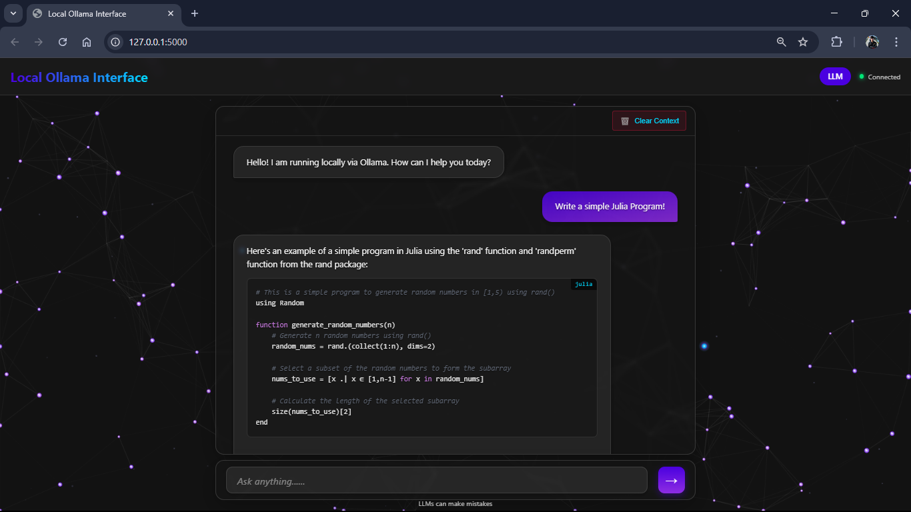

# Ollama Neural Interface

<div align="center">
  <h3>A Beautiful Web UI for Local LLM Interaction</h3>
  <p>Experience your locally-hosted Ollama models through an elegant, responsive interface with dynamic neural visualizations</p>
  
  
  
  
</div>

---

## 📖 Overview

The Ollama Neural Interface provides a sleek, modern web interface for interacting with locally-hosted large language models via Ollama. It features an aesthetically pleasing neural network visualization that responds to your conversation, creating an immersive AI interaction experience while maintaining complete privacy as all processing happens locally on your machine.

Whether you're using Ollama for creative writing, programming assistance, or casual conversation, this interface enhances the experience with beautiful visuals, intuitive controls, and persistent chat sessions.

---

## 🌟 Features

- **✨ Interactive Neural Visualization**: Mesmerizing background neural network that:
  - Dynamically responds to chat activity
  - Displays animated signal particles during thinking
  - Scales automatically to different screen sizes
  - Creates a visually engaging AI experience

- **💬 Advanced Chat Interface**: 
  - Clean, modern UI design with smooth animations
  - Typewriter-style text rendering for natural interactions
  - Markdown support with automatic formatting
  - Code block detection with syntax highlighting
  - Session persistence between browser refreshes

- **📚 Memory Management**:
  - Maintains conversation history across multiple chat sessions
  - Persistent storage through `chat_memory.json`
  - Configurable history limits and session management
  - Context preservation for coherent, ongoing conversations

- **🖥️ Complete Local Processing**:
  - All LLM operations happen on your machine through Ollama
  - No data sent to external servers
  - Connect to any model available in your local Ollama installation

- **🎨 Customization Options**:
  - Configurable theme with adjustable colors
  - Neural visualization parameters can be fine-tuned
  - Model selection and display options
  - Server settings and connection parameters

## 📋 Requirements

- **Python 3.8+**
- **Flask 3.1.0+**
- **Requests 2.32.3+**
- **Java Development Kit (JDK) 17+**
- **Ollama** installed and running locally with at least one model downloaded

## 🔧 Installing Java Development Kit (JDK)

### Windows

1. Visit the [Oracle JDK download page](https://www.oracle.com/java/technologies/downloads/)
2. Download the Windows x64 Installer for the latest JDK
3. Run the installer and follow the installation wizard
4. Add Java to your system PATH if not done automatically
5. Verify installation by opening Command Prompt and typing:
```bash
java --version
```

### macOS

1. Using Homebrew (recommended):
```bash
brew install openjdk@17
```

2. Or download from Oracle:
   - Visit [Oracle JDK download page](https://www.oracle.com/java/technologies/downloads/)
   - Download the macOS installer
   - Run the package installer

### Linux

For Debian/Ubuntu-based distributions:
```bash
sudo apt update
sudo apt install openjdk-17-jdk
```

For Red Hat/Fedora:
```bash
sudo dnf install java-17-openjdk-devel
```

For Arch Linux:
```bash
sudo pacman -S jdk17-openjdk
```

Verify installation on any platform:
```bash
java --version
```

## 🔧 Installing Ollama

### Windows

1. Visit the official [Ollama website](https://ollama.ai/download/windows)
2. Download the Windows installer
3. Run the installer and follow the on-screen instructions
4. After installation, Ollama will start automatically and be accessible in your system tray

### macOS

1. Visit the official [Ollama website](https://ollama.ai/download/mac)
2. Download the macOS installer
3. Open the downloaded file and drag the Ollama app to your Applications folder
4. Launch Ollama from your Applications folder

### Linux

#### Using the install script

```bash
curl -fsSL https://ollama.com/install.sh | sh
```

#### From source or specific distributions

For Debian/Ubuntu-based distributions:
```bash
sudo apt-get update
sudo apt-get install -y ollama
```

For Arch Linux:
```bash
yay -S ollama-bin
```

Once installed, start the Ollama service:
```bash
ollama serve
```

## 📥 Installing the TinyDolphin Model

After installing Ollama, you need to download the model specified in the configuration (default is `tinydolphin:latest`):

### All Platforms (Windows, macOS, Linux)

Open a terminal or command prompt and run:

```bash
ollama pull tinydolphin:latest
```

This downloads the TinyDolphin model (a lightweight LLM model) to your system.

To verify the model was installed correctly:
```bash
ollama list
```

You should see `tinydolphin:latest` in the list of installed models.

> **Note:** If you prefer a different model, you can replace "tinydolphin:latest" with any other Ollama-compatible model like "llama3:latest", "mistral:latest", etc., both in the command and in your config.json.

## 🚀 Quick Start

### Installation

1. **Clone the repository**
   ```bash
   git clone https://github.com/yourusername/ollama-neural-interface.git
   cd ollama-neural-interface
   ```

2. **Install required Python packages**
   ```bash
   pip install -r requirements.txt
   ```

3. **Verify Ollama is running**
   ```bash
   # Windows (PowerShell)
   Invoke-RestMethod -Uri http://localhost:11434/api/tags
   
   # macOS/Linux
   curl http://localhost:11434/api/tags
   ```
   If you get a list of your models, Ollama is running correctly.

### Running the Application

1. **Start the application**
   ```bash
   python backend.py
   ```

2. **Access the interface**
   - Open your browser to `http://localhost:5000`
   - You should see the neural interface and be able to start chatting

3. **Select a model (optional)**
   - The application uses the model specified in `config.json` by default
   - You can modify `config.json` to use a different model

## 📱 Interface Overview

The interface consists of several key components:

1. **Neural Background** - A dynamic visualization covering the entire viewport
2. **Chat Panel** - A floating panel where your conversation happens
3. **Input Area** - Where you type your messages
4. **Model Badge** - Shows the current active model
5. **Status Indicator** - Shows connection status to Ollama

<div align="center">
  
</div>

## ⚙️ Configuration

The application behavior is controlled through `config.json`. Edit this file to customize your experience.

### Key Configuration Sections:

#### Server Settings
```json
"server": {
  "port": 5000,
  "debug": true,
  "host": "0.0.0.0"
}
```
- `port`: Web server port (default: 5000)
- `debug`: Enable debug logging (default: true)
- `host`: Server host address (0.0.0.0 allows external connections)

#### Ollama Connection
```json
"ollama": {
  "base_url": "http://localhost:11434",
  "api_endpoints": {
    "generate": "/api/generate",
    "tags": "/api/tags"
  },
  "model": "tinydolphin:latest",
  "display_name": "LLM",
  "request_timeout": 60,
  "connection_check_timeout": 5,
  "history_context_limit": 10
}
```
- `base_url`: Ollama API location
- `model`: The Ollama model to use (must be downloaded in Ollama)
- `request_timeout`: Maximum seconds to wait for model responses
- `history_context_limit`: Number of past messages to include for context

#### Memory Settings
```json
"memory": {
  "max_sessions": 10,
  "max_history_per_session": 20,
  "memory_file": "chat_memory.json",
  "auto_save": true
}
```
- `max_sessions`: Maximum number of chat sessions to retain
- `max_history_per_session`: Maximum messages stored per chat session
- `memory_file`: Where chat history is saved
- `auto_save`: Whether to automatically save chat history

#### UI Customization
```json
"ui": {
  "app_name": "Ollama Neural Interface",
  "display_name": "Local Ollama Interface",
  "theme": {
    "primary_color": "#4a00e0",
    "secondary_color": "#8e2de2",
    "background_dark": "#121212",
    "background_light": "#1a1a1a",
    "text_color": "#e0e0e0",
    "accent_color": "#00d9ff"
    // ... additional theme options
  }
}
```

#### Neural Visualization
```json
"neural_visualization": {
  "neuron_density": 0.00012,
  "neuron_min_size": 2,
  "neuron_max_size": 6,
  "connection_distance_factor": 0.20,
  "connection_opacity": 0.15,
  "active_neuron_color": "#00d9ff",
  "default_neuron_color": "#4a00e0"
  // ... additional visualization options
}
```

## 📁 Project Structure

```
ollama-neural-interface/
├── backend.py               # Flask server that handles API requests
├── config.json              # Application configuration
├── chat_memory.json         # Persistent storage for chat history
├── requirements.txt         # Python dependencies
└── static/                  # Frontend assets
    ├── index.html           # Main application HTML
    ├── styles/
    │   └── style.css        # Application styling
    ├── scripts/
    │   ├── chat.js          # Chat interface functionality
    │   ├── neuron.js        # Neural network visualization
    │   └── config.js        # Configuration management
    └── libs/                # Third-party libraries
        ├── highlight.min.js # Code syntax highlighting
        ├── gsap.min.js      # Animation library
        └── atom-one-dark.min.css # Highlighting theme
```

### Key Components

- **Backend (Python/Flask)**: 
  - Provides a RESTful API that communicates with Ollama
  - Manages chat sessions and history
  - Streams model responses in real-time

- **Frontend (HTML/CSS/JavaScript)**:
  - Neural visualization using Canvas API
  - Chat interface with markdown and code highlighting
  - Dynamic configuration loading

## 🔌 API Endpoints

The backend provides several API endpoints for the frontend:

| Endpoint | Method | Description |
|----------|--------|-------------|
| `/api/generate` | POST | Streams responses from Ollama's LLM |
| `/api/history` | GET | Retrieves chat history for a session |
| `/api/sessions` | GET | Lists all available chat sessions |
| `/api/tags` | GET | Gets available models from Ollama |
| `/api/config` | GET | Provides configuration for the frontend |
| `/api/clear-session` | POST | Clears history for a specific session |

## 🎭 Neural Visualization Details

The dynamic neural network visualization creates an engaging backdrop that responds to:

- **User input**: When you send a message, neurons activate in a wave pattern
- **AI thinking**: During response generation, the "thinking" mode shows increased activity
- **Idle state**: Random subtle activations keep the visualization lively

The visualization is highly configurable through the `neural_visualization` section in `config.json`.

### How It Works

The visualization uses HTML5 Canvas to create a network of:

1. **Neurons**: Individual nodes that can activate
2. **Connections**: Lines between neurons that show relationships
3. **Signal particles**: Animated dots that travel along connections
4. **Ambient particles**: Background elements that create depth

These elements combine to create a living representation of neural activity that responds to the conversation flow.

## 📝 How Chat Sessions Work

1. Each conversation is assigned a unique session ID
2. Messages are stored with role (user/ai), content, and timestamp
3. When a new message is sent, relevant context is included for continuity
4. Sessions are automatically saved to disk for persistence
5. Old sessions are pruned when `max_sessions` is reached

## 🔄 Using Multiple Models

You can easily switch between different LLM models:

1. First, ensure you have pulled the desired model with Ollama:
   ```bash
   ollama pull llama3
   ```

2. Then update the model name in `config.json`:
   ```json
   "ollama": {
     "model": "llama3",
     ...
   }
   ```

3. Restart the neural interface

## ⚠️ Troubleshooting

### Ollama Connection Issues:
- **Ollama Not Running**:
  - Windows: Check if Ollama is running in the system tray
  - macOS: Check Activity Monitor for the Ollama process
  - Linux: Run `ps -aux | grep ollama` to check if the process is running
  
- **Connection Failed**:
  - Ensure Ollama is running (`curl http://localhost:11434/api/tags`)
  - Check if the model specified in config.json is available in Ollama
  - Verify the port settings match your Ollama installation

### Server Issues:
- **Port Already in Use**:
  - Change the port in `config.json` if 5000 is already taken
  - Check for other processes using `netstat -ano | findstr :5000` (Windows) or `lsof -i :5000` (macOS/Linux)

- **Permission Errors**:
  - Ensure you have write permissions in the directory for chat_memory.json
  - Try running with elevated privileges if needed

- **Python Errors**:
  - Verify Python dependencies are installed
  - Check console output for specific error messages

### Interface Issues:
- **Chat Not Working**:
  - Clear your browser cache and refresh
  - Check browser console for JavaScript errors
  - Restart both Ollama and the neural interface

- **Visual Glitches**:
  - Try a different browser (Chrome or Firefox recommended)
  - Adjust neural visualization parameters in config.json to reduce complexity

## 🚀 Performance Tips

1. **For slower computers**:
   - Reduce `neuron_density` and `particle_density` in config.json
   - Set `thinking_max_particles` to a lower value

2. **For better visuals on powerful machines**:
   - Increase `neuron_density` for more complex networks
   - Increase `connection_distance_factor` for more connections

3. **For faster responses**:
   - Use smaller models like tinydolphin
   - Reduce `history_context_limit` in config.json

## 📚 License and Attribution

This project is released under a proprietary license. See the [LICENSE.md](LICENSE.md) file for details.

**Important License Notice:**
- Personal use only
- No commercial use allowed
- No modification permitted
- No redistribution allowed
- Public use requires explicit written permission from the author

This project uses the following third-party components:
- **highlight.js** for code syntax highlighting
- **GSAP** for animations
- **Ollama** for local LLM capabilities

## 🔔 Notes

- The interface works best in modern browsers (Chrome, Firefox, Edge)
- Mobile experience is supported but desktop is recommended for full visualization
- Large language models can sometimes provide incorrect information
- Chat history is stored locally in `chat_memory.json`

Contributions are welcome! If you'd like to improve the Ollama Neural Interface, please:

1. Fork the repository
2. Create your feature branch (`git checkout -b feature/amazing-feature`)
3. Commit your changes (`git commit -m 'Add some amazing feature'`)
4. Push to the branch (`git push origin feature/amazing-feature`)
5. Open a Pull Request

## 📬 Contact

If you have questions, suggestions, or need help, reach out through:
- GitHub Issues
- Email: kashyapmayank446@gmail.com